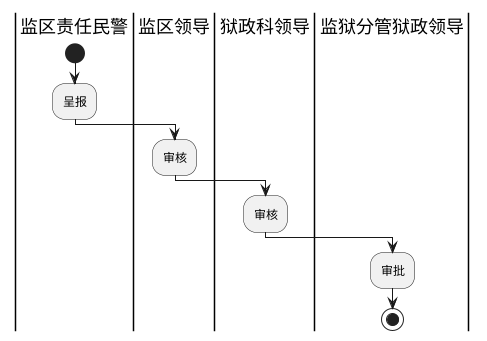

# 需求规格说明书功能卡片模板

---

## 目录

[审批模板](#审批模板)
[登记模板](#登记模板)

---

### 审批模板

##### 功能概述

审批是指对满足x条件的罪犯做的全流程审批业务办理

##### 用户场景

岗位 | 角色 | 描述
-----|------|---
|分监区民警||aaa|
|监区领导||aaa|

##### 业务流程

##### 输入/前置条件

“”

##### 需求详述

首页由查询条件、功能操作区域（创建业务、批量打印）、数据展示区域组成,如下图

具体字段、编码描述如下：

1. 查询条件
    数据列表用于对单位权限内的人员数据筛选。用户可通过以下字段查询相关业务信息，具体字段描述如下：
   
|字段名称|编码|描述|约束|
|---|---|---|---|
|||||

提供“查询”、“清空”功能。具体描述如下：

- 查询：录入查询条件，点击“查询”按钮可以查询到符合查询条件的数据；若查询条件为空，点击“查询”，可查询到所有数据
- 清空：点击“清空”按钮，即可清空输入的查询条件

2. 数据展示区域
  数据列表支持对列表展示字段进行正序、倒序的排序筛选；具体字段、编码描述如下：

|字段名称|编码|描述|约束|
|---|---|---|---|
|||||

提供“查看”、“打印”功能。具体描述如下：

- 点击“查看“”即可查看审批完成（结束）的业务表单信息；具体字段同审批业务。
- 点击“打印”，弹出选择打印类型提示框，勾选打印的类型，点击“确定”，即可进入打印预览界面。支持打印以下电子附件：
   《》

3. 功能区域
   包含：“创建业务”、“批量打印”功能。具体描述如下：

**3.1创建业务**
  点击“创建业务”弹窗确认提示框。确认后显示审批业务发起通知，进入审批业务流程，筛选人员数据。具体描述如下：

_3.1.1流程角色_
  审批流程中的角色由统一的流程引擎配置。支持查看流程办理步骤及状态

_3.1.2查询条件_
  用户可通过以下字段查询相关业务信息，具体字段描述如下：

|字段名称|编码|描述|约束|
|---|---|---|---|
|||||

提供“查询”、“清空”功能。具体描述如下：

- 查询：录入查询条件，点击“查询”按钮可以查询到符合查询条件的数据；若查询条件为空，点击“查询”，可查询到所有数据
- 清空：点击“清空”按钮，即可清空输入的查询条件

_3.1.3数据筛选区域_
  数据列表用于对单位权限内的人员数据筛选。支持对列表展示字段进行正序、倒序的排序筛选；支持人员数据多选。提供“默认状态、已选中、全选状态”人员数据筛选。具体字段、编码描述如下：

|字段名称|编码|描述|约束|
|---|---|---|---|
|姓名||||
|罪犯编号||||
|单位||||
|罪名||||
|刑期||||
|刑期起日||||
|刑期止日||||
|所在小组||||

_3.1.4功能区域_
  包含“展开/收起业务列表”、“下一步”、“提交”、“作废”功能。具体描述如下：

  3.1.4.1展开/收起
  支持查看审批业务列表；包含业务名称/角色、办理时间、流程作废功能。

  3.1.4.2下一步
  在数据列表选择人员数据通过点击“下一步”进入呈报信息填报界面。（备注：不选择人员可以进入，但是无人员信息。建议不选择人员不允许进入）。
  
   具体字段、编码描述如下：

|字段名称|编码|描述|约束|
|---|---|---|---|
|||||

具体功能描述如下：

- 支持把人员数据从流程中批量移除“批量取消”
- 支持返回人员数据筛选界面。
- 支持对选择的人员数据进行附件上传
- 支持对选择的人员数据打印《》、《》
- 提供“录入”功能。支持对选择的人员数据进行呈报信息录入。录入的表单信息字段、编码描述如下：
  
|字段名称|是否必填|编码|描述|约束|
|---|---|---|---|---|
||||||

录入的呈报信息字段、编码描述如下：

|字段名称|编码|描述|约束|
|---|---|---|---|
|处理意见||必填，自填。约束一定字段长度（可设）。提供保存模板、选择模板、签章、撤销等功能||
|是否同意||为当前流程处理人（警察）处理态度，默认同意，可变更，流程第一步不可变更||
|签字||默认当前流程处理人（警察），不可编辑。可考虑接入电子签名||
|日期||必填项，流程处理日期，默认当前日期，可变更||

提供数据保存功能，点击“保存并一条”校验数据是否满足呈报条件。

  3.1.4.3提交
  公共模块，呈报意见/审批意见填写验证通过后允许提交到流程中具有角色权限的人员。

  3.1.4.4作废
  录入作废意见，点击“确认”后。取消（终止）流程办理。

  3.1.4.5回退
  一定权限角色用于对呈报信息做审核时对流程退回的处理，点击“回退”后。选择回退角色，录入回退意见即可。

**3.2批量打印**
   选择人员数据（支持多选）后，点击“批量打印”，弹出选择打印类型提示框，勾选打印的类型，点击“确定”，即可进入打印预览界面。支持打印以下电子附件：

   《》

##### 输出/后置条件

“”业务可查询到此业务的人员信息及业务信息数据

##### 补充说明

无

支持打印以下表单信息：

《罪犯入监通知书》
《罪犯收监通知单》

 ---

### 登记模板

##### 功能概述

用于一定岗位权限的民警对单位权限内的被服仓库信息进行数据维护及管理

##### 用户场景

岗位 | 角色 | 描述
-----|------|---
|责任民警||登记|

##### 业务流程

无

##### 输入/前置条件

无

##### 需求详述

首页由查询条件、功能操作区域、数据展示区域组成,如下图

具体字段、编码描述如下：

1、 查询条件
    数据列表用于对单位权限内的人员数据筛选。用户可通过以下字段查询相关业务信息，具体字段描述如下：
   
|字段名称|编码|描述|约束|
|---|---|---|---|
|||||

提供“查询”、“清空”功能。具体描述如下：

- 查询：录入查询条件，点击“查询”按钮可以查询到符合查询条件的数据；若查询条件为空，点击“查询”，可查询到所有数据
- 清空：点击“清空”按钮，即可清空输入的查询条件

2、 数据展示区域
  数据列表支持对列表展示字段进行正序、倒序的排序筛选；具体字段、编码描述如下：

|字段名称|编码|描述|约束|
|---|---|---|---|
|||||

提供“查看”、“打印”功能。具体描述如下：

- 点击“查看”即可查看审批完成（结束）的业务表单信息；具体字段同审批业务。
- 点击“打印”，弹出选择打印类型提示框，勾选打印的类型，点击“确定”，即可进入打印预览界面。支持打印以下电子附件：
   《》

3、 功能区域
   包含：“添加”、“批量添加”、“批量删除”、“打印”、“查看详情”、“批量打印”功能。具体描述如下：

   -3.1 添加
  点击“添加”显示新增信息录入区域，添加成功后数据列表新增一条数据；新增信息录入区域字段、编码详情如下：

|字段名称|是否必填|描述|约束|
|---|---|---|---|
|||||

提供“保存”、“保存并新增”、“取消”功能。具体描述如下：

“保存”按钮：录入必填信息，点击“保存”按钮即可保存本条数据，数据区域新增一条数据；
“保存并新增”按钮：录入必填信息，点击“保存并新增”按钮即可保存本条数据，数据区域新增一条数据；并打开一个新的数据表单录入界面
“删除”按钮：点击“删除”按钮，弹出删除确认提醒，点击“确认”，删除本条信息，数据区域减少一条数据
“取消”按钮：点击“取消”按钮，弹出取消确认提醒，点击“确认”，录入的数据信息不会保存。

- 批量添加
  点击“批量添加”进入添加新收监人员，录入新收押罪犯的基本信息。各字段、编码详情如下：

|字段名称|是否必填|描述|约束|
|---|---|---|---|
|||||

提供“保存”、“删除”功能。具体描述如下：

“关闭”按钮，点击关闭图标，即可关闭
“保存”按钮，必填信息，点击“保存”按钮，即可保存多个新收押罪犯信息

- 批量删除
  对应业务科室的责任民警/领导选中要删除的多项数据，点击“批量删除”按钮，弹出批量删除确认按钮，点击“确认”，删除选中的多项数据

- 打印
  点击“打印”，弹出选择打印类型提示框，勾选打印的类型，点击“确定”，即可进入打印预览界面。支持打印《》、《》

- 查看详情
  点击查看详情显示查看详情界面，字段同登记字段。不可编辑。

- 批量打印
   点击“批量打印”，弹出选择打印类型提示框，勾选打印的类型，点击“确定”，即可进入打印预览界面。支持打印《预刑释罪犯登记表》

- 批量导入
  批量导入用于历史数据批量导入。提供模板下载和导入入口。通过“导入模板下载”下载约定格式的Excel模板。整理好满足Excel数据格式条件的数据后通过“导入Excel”进行数据导入。
  备注：数据格式一定要满足Excel约定条件。否则会出现数据导出出错（重复数据、错误数据、造成系统报错等问题）

##### 输出/后置条件

“”业务可查询到此业务的人员信息及业务信息数据

##### 补充说明

无

支持打印以下表单信息：

《罪犯入监通知书》
《罪犯收监通知单》

---

