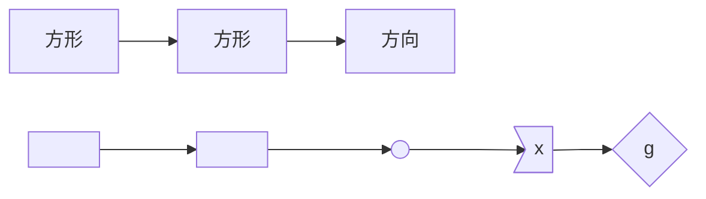

# mermaid流程图模板

## 模板

## 描述

> 备注  
>
>  1. 形状
>  
> - x[y] 矩形不可缺省值（y）  
> - x(y) 圆角矩形;不可缺省值（y）  
> - x((y))圆,双圆括号;不可缺省值（y）  
> - x>y]不规则矩形；不可缺省值（y）
>  
> 2. 线条
>  
> -  ---      实线
> -  -->      带箭头的实线
> -  -->|x|   带数字x、带箭头的实线
>  -  -.-     虚线
> -  -.->     带箭头的虚线
> -  -.->|x|  带数字x、带箭头的虚线
>  